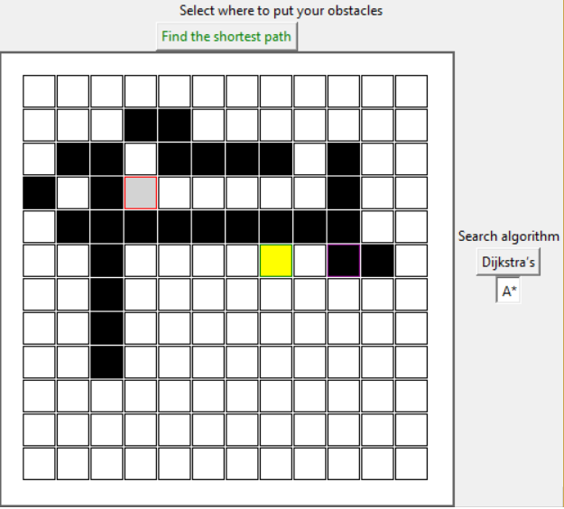
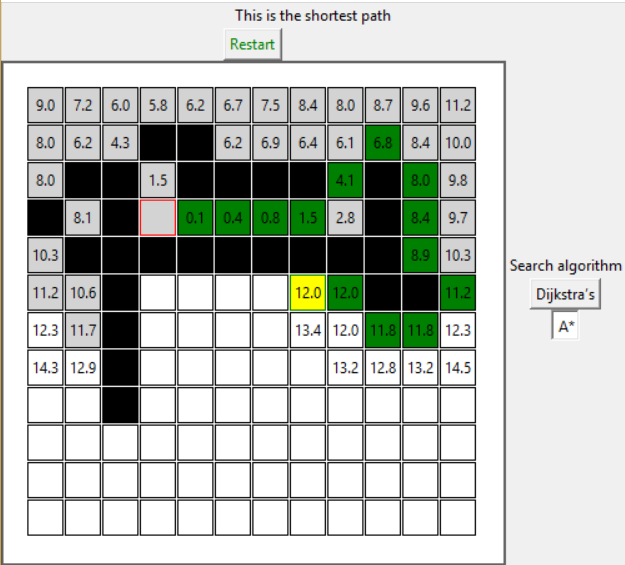

# path-finder

This is a tool to show path-finding algorithms.
So far the options are:
* [A* search algorithm](https://en.wikipedia.org/wiki/A*_search_algorithm)
* [Dijkstra's algorithm](https://en.wikipedia.org/wiki/Dijkstra%27s_algorithm)

## How to use it
Run main.py to see the pure BE version of the path-finding algorithm.
Run GUI.py to see the UI.
Place the starting point and end point. Then place any obstacle you desire.
Then hit the button to solve it and show the shortest path

## Example

## Advanced
As you may have seen, once you run the scenario, there are some numbers that are calculated. Those numbers are the ones to decide which cell should be the best next step to take the shortest road to the destination cell.

### How are those numbers calculated?
1. We set as solved the starting point.
2. Set all the cells that are next to the solved points as "to be visited".
3. Calculate the cumulative_distance to each "to be visited" point, using the following formula:

**Cumulative distance (A*)**
cumulative_distance (x2,y2) = cumulative_distance(x1,y1) + distance_to_previous(x2,y2) + distance_to_destination(x2,y2) - distance_to_destination(x1,y1)

4. From all the "to be visited" points, set as solved the one with the lower cumulative_distance. If it's a tie, we choose one randomly.
4.1 For the solved cell, store the cell that solved it, the cell that selected it as "to be visited"
5. Repeat 2, 3, 4 until the final destination is set as solved.

Like this, cumulative distance is the sum of all the cumulative_distances from the beginning to each point.

As of how to calculate this distance, it is euclidean distance. 

distance = ((x1-x0)^2 + (y1-y0)^2) ^ (1/2)

#### Difference between A* and Dijkstra
Dijkstra will be a special case of A*, the case on which we have no information at all of where the destination is.
That said, the cumulative distance formula would be 

**Cumulative distance (Dijkstra)**
cumulative_distance (x2,y2) = cumulative_distance(x1,y1) + distance_to_previous(x2,y2)

As you see, there is no distance to destination

### Drawing the shortest path
Once the destination cell is solved, we just draw back the path. How?
In 4.1, we stored for each solved cell the position of the cell that solved it.
Therefore, we:
1. Go into the destination cell
2. Set it as path.
3. Check the cell that solved it.
4. Repeat steps 2 and 3 until the cell is the origin cell.